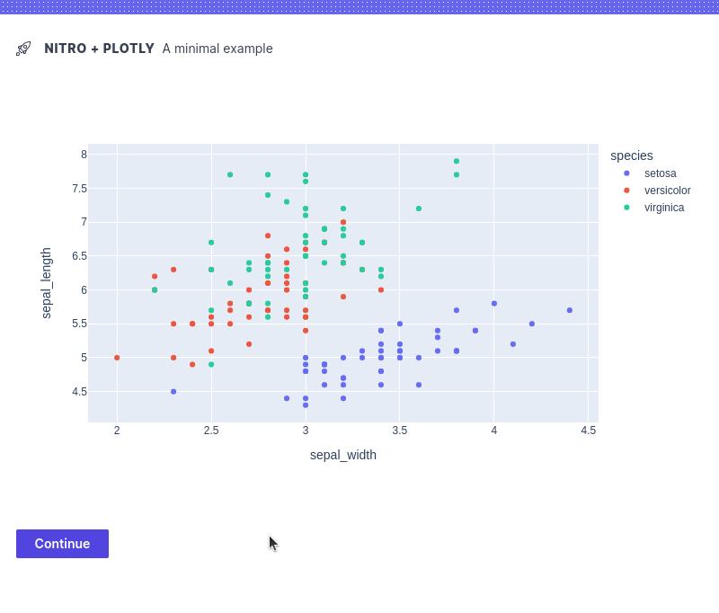

# Plotly plugin for H2O Nitro

This plugin lets you use [Plotly](https://plotly.com/python/) visualizations in [Nitro](https://github.com/h2oai/nitro)
apps.

## Demo



[View source](examples/plotly_basic.py).

## Install

```
pip install h2o-nitro-plotly
```

## Usage

1. Import the plugin:

```py 
from h2o_nitro_plotly import plotly_plugin, plotly_box
```

2. Register the plugin:

```py 
nitro = View(main, title='My App', caption='v1.0', plugins=[plotly_plugin()])
```

3. Use the plugin:

```py 
# Make a plot
df = px.data.iris()
fig = px.scatter(df, x="sepal_width", y="sepal_length", color="species")

# Display the plot
view(plotly_box(fig))
```

## Change Log

- v0.1.0 - Dec 1, 2022
    - Initial Version

